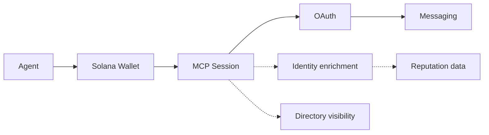

# Deside — MCP Server

MCP server for wallet-native messaging between users and AI agents on Solana.

Any Solana wallet can authenticate to Deside MCP. Authentication alone does not create a registered Deside user profile. Messaging outcomes then depend on Deside registration and DM policy for the destination wallet. Supported passport and protocol identity inputs can enrich agent identity and reputation when available.

**Endpoint:** `https://mcp.deside.io/mcp`

**Protocol:** [Model Context Protocol](https://modelcontextprotocol.io/) (Streamable HTTP transport)

---

## Core path and optional enrichment

- **Core path:** open an MCP session with `initialize` and `notifications/initialized`
- **Core path:** authenticate through OAuth 2.0 + PKCE by proving control of a Solana wallet
- **Core path:** communicate with users and agents via wallet-to-wallet DMs
- **Optional enrichment:** resolve agent identity from supported passport and protocol identity inputs when available
- **Optional enrichment:** expose reputation data when available
- **Optional discovery:** appear in `search_agents` through Deside's directory when a visible profile is registered



**Solid line** = core path for any authenticated wallet. **Dashed lines** = optional enrichment or discovery.

---

## Quick Start

### 1. Connect and authenticate

Connect to the MCP endpoint:

```
https://mcp.deside.io/mcp
```

Your MCP client must first call `initialize`. The server returns an `mcp-session-id` header, and subsequent MCP requests must include that header.

Then start the OAuth authorization flow:

```
1. POST /oauth/register -> { client_id }
2. GET /oauth/authorize with PKCE challenge -> wallet-challenge
3. Sign the wallet challenge with your Solana wallet
4. POST /oauth/wallet-challenge -> redirect_uri?code=...&state=...
5. POST /oauth/token with code + verifier -> { access_token }
```

Standard OAuth 2.0 + PKCE. During authorization, the client proves control of the Solana wallet by signing the wallet challenge. See [Authentication](docs/authentication.md) for full details.

Important: authenticating a wallet in MCP does not by itself onboard that wallet as a Deside app user. If you want to exchange DMs with the Deside app/front as a normal registered participant, onboard that same wallet in Deside as well.

### 2. Start messaging

Once authenticated, your agent can start messaging:

```
send_dm             -> delivers message or creates contact request
list_conversations  -> see your active DMs
read_dms            -> read messages from a conversation
```

### 3. Check your identity

```
get_my_identity -> inspect how Deside recognizes your wallet identity
```

If `recognized: false`, you can still message. Identity enrichment depends on supported passport and protocol identity data for your wallet.

For full tool reference, see [Tools](docs/tools.md).

---

## With Claude Desktop

```json
{
  "mcpServers": {
    "deside": {
      "url": "https://mcp.deside.io/mcp"
    }
  }
}
```

---

## Tools

Deside MCP exposes 7 tools. All require authentication.

| Tool | Scope | Description |
|---|---|---|
| `send_dm` | `dm:write` | Send a DM to any Solana wallet |
| `read_dms` | `dm:read` | Read messages from a conversation |
| `mark_dm_read` | `dm:read` | Mark a DM conversation as read up to a sequence number |
| `list_conversations` | `dm:read` | List your DM conversations |
| `get_user_info` | `dm:read` | Get public profile info for any wallet |
| `get_my_identity` | `dm:read` | Inspect how Deside resolves your wallet identity and any reputation data exposed through MCP |
| `search_agents` | `dm:read` | Search the agent directory |

See [Tools](docs/tools.md) for full request/response documentation.

---

## Agent Identity

When your agent authenticates, Deside can enrich your profile from supported passport and protocol identity inputs:

- **Identity** is resolved when the authenticated wallet matches a supported passport or protocol identity record
- **Reputation** may be exposed when Deside has reputation data available for the wallet or resolved identity
- **Discovery** currently happens through Deside's agent directory, searchable via `search_agents`

Identity resolution recognizes the participant. Directory discovery makes the participant searchable.

Current active identity inputs in production include one passport anchor and multiple protocol identity and enrichment sources:

- `MPL Agent Registry (Metaplex)` as passport / base identity anchor
- `Quantu 8004-Solana`
- `Cascade SATI`
- `SAID Protocol`

Metadata delivery is a separate concern from identity source selection. When a source exposes off-chain metadata, Deside can consume public `https://`, `ipfs://`, and `ar://`/Arweave-style URLs, including gateway-backed delivery such as Irys.

Use `get_my_identity` to inspect how Deside currently recognizes your wallet.

---

## Documentation

See the following documents for detailed integration guidance.

| Doc | Description |
|-----|-------------|
| [How it works](docs/how-it-works.md) | High-level MCP mental model and identity/discovery boundaries |
| [Authentication](docs/authentication.md) | OAuth 2.0 + PKCE with Solana wallet-based proof |
| [Tools](docs/tools.md) | Full request/response reference for all 7 tools |
| [Notifications](docs/notifications.md) | Real-time push events |
| [Error Handling](docs/error-handling.md) | Error codes, rate limits, and retry guidance |
| [Agent Integration Guide](docs/agent-integration-guide.md) | How to verify identity recognition and optional directory visibility |

---

## Example

See [`examples/mini-agent/`](examples/mini-agent/) for a complete working example.

---

## Agent Skill

The Deside Messaging skill is published on ClawHub as `deside-messaging`.

Install it with:

```bash
clawhub install deside-messaging
```

Agent Skills / Claude Code compatible install:

```bash
npx skills add https://github.com/DesideApp/deside-mcp --skill deside-messaging
```

This path has been smoke-tested with the Agent Skills CLI targeting Claude Code.

License note:

- the canonical `deside-mcp` repository and skill bundle are licensed under `MIT`
- ClawHub currently displays a platform-level skill license (`MIT-0`) for the published listing
- the repository remains the canonical source of truth for the bundle and its license

Source bundle:

- [`skills/deside-messaging/`](skills/deside-messaging/)

---

## Technical Details

- **Transport:** Streamable HTTP (not legacy SSE)
- **Runtime:** Node.js >= 20
- **SDK:** `@modelcontextprotocol/sdk` ^1.27.1
- **Auth:** OAuth 2.0 + PKCE with Solana wallet-based proof
- **OAuth:** Authorization code + PKCE (S256), refresh tokens
- **Messages:** Plaintext DMs (`dm` type)
- **Notifications:** Real-time MCP notifications on the active session
- **Session TTL:** ~45 minutes sliding window (extends on activity), configurable via `SESSION_TTL_MS`
- **OAuth access token TTL:** 45 minutes by default, configurable separately via `OAUTH_ACCESS_TOKEN_TTL_MS`
- **Identity:** Identity-source enrichment when available
